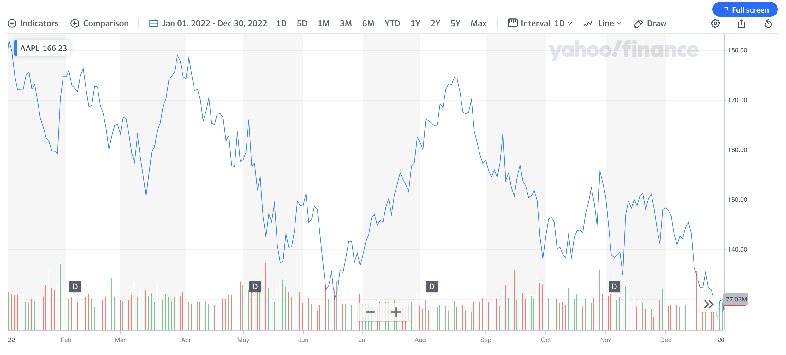
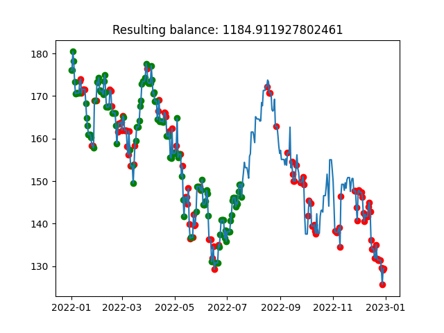

# Tradingbot

Tradingbot is an algorithm able to trade a certain asset in real-time.
The algorithm learns the importance (weights) of individual trading strategies to use in order to make a decision to buy
or sell.

# Prerequisites

Tradingbot requires offline stock trading data to be downloaded and stored in `/data`.

# Chromosome structure

```
[weight_of_trading_strategy: float <0,1>]
```

Configurable parameters (.env):

- Total amount of money to trade: BUDGET
- Starting timestamp: START_TIMESTAMP
- Date of evaluation: END_TIMESTAMP
- Backtest period start timestamp: BACKTEST_START_TIMESTAMP
- Backtest period end timestamp BACKTEST_END_TIMESTAMP
- TRADED_TICKER_NAME: Name of the traded ticker (used to read training data at `data/data-$TRADED_TICKER_NAME.csv`)
- RETURN_GLOBAL_WINNER: If True, best individual from all epochs is returned. If False, best individual from the last
  epoch is returned
- USE_REDIS_FITNESS_CACHE: Use Redis to cache results of the fitness function

See `config.py` for data types of parameters mentioned above.

# Run via make

```
make run-tradingbot
```

# Run via Docker-compose

```
docker-compose up
```

# Connect to Redis instance

Redis instance contains cached fitness function results if `USE_REDIS_FITNESS_CACHE=True`

```
docker exec -it redis redis-cli
```

# Example output

In this example, we are going to demonstrate the ability of the algorithm to trade AAPL stock between periods of
1.1.2022 and 30.12.2022.

The following graph plots AAPL stock price during this period. We can see there is an overall downtrend and the period
contains multiple short-term uptrends and downtrends.
This period has been chosen as a backtesting period to demonstrate the algorithm's ability to learn to predict the
short-term stock trends and achieve profit even in this downtrend period.



The algorithm received a trading budget of 1000USD and achieved 18.4% profit. The following trading strategy weights
have been learned by the algorithm. Strategies are implemented in `decisions.py` and are based on various technical market indicators:

```
Found winner with weights [('decide_adi', 0.5), ('decide_adx', 0.06), ('decide_cmf', 0.55), ('decide_death_cross', 0.79), ('decide_dpo', 0.14), ('decide_em', 0.7), ('decide_ema_20_vs_50', 0.99), ('decide_golden_cross', 0.52), ('decide_macd', 0.12), ('decide_mfi', 0.22), ('decide_nvi', 0.43), ('decide_rsi', 0.8), ('decide_sentiment', 0.36), ('decide_sma_fast', 0.42), ('decide_sma_slow', 0.12), ('decide_so', 0.88), ('decide_stoch_rsi', 0.07), ('decide_trix', 0.55), ('decide_tsi', 0.65), ('decide_tsi_signal', 0.51), ('decide_uo', 0.06), ('decide_vi', 0.01), ('decide_vpt', 0.79), ('decide_vpt_adx', 0.93), ('decide_vwap', 0.09), ('decide_williams', 0.02)]
```

The following chart plots the stock price during the backtesting period. Green dots mark BUY positions made by the algorithm and red dots mark SELL positions (size of the dots does not reflect the size of BUY/SELL positions).


